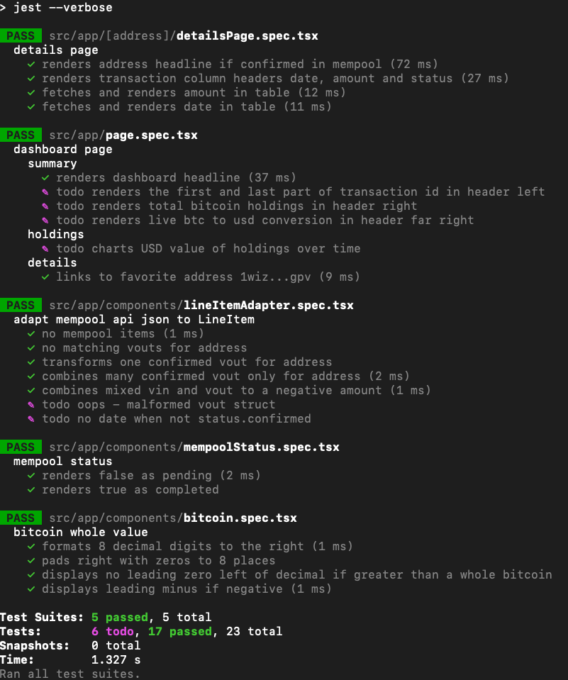

Previously, on [Day 01](s01.md) we got the technical setup and the UI showing fixed values. It seemed like a cheat to hardwire those. "fake it 'till you make it" as my dad taught me. 

Day 02 is plumbing out the embryonic UI
to fetch from the real mempool API. Known as a "walking skeleton" can we get 
some trivial data from the mempool to the UI? Can we grow this system guided by tests without introducing the problem of slow flickering tests dependent on the internet and a 3rd party api?

Yes. Today we are practicing [TDD guided by zombies](https://blog.wingman-sw.com/tdd-guided-by-zombies) towards [ports and adapters](https://alistair.cockburn.us/hexagonal-architecture/).

Final score:

